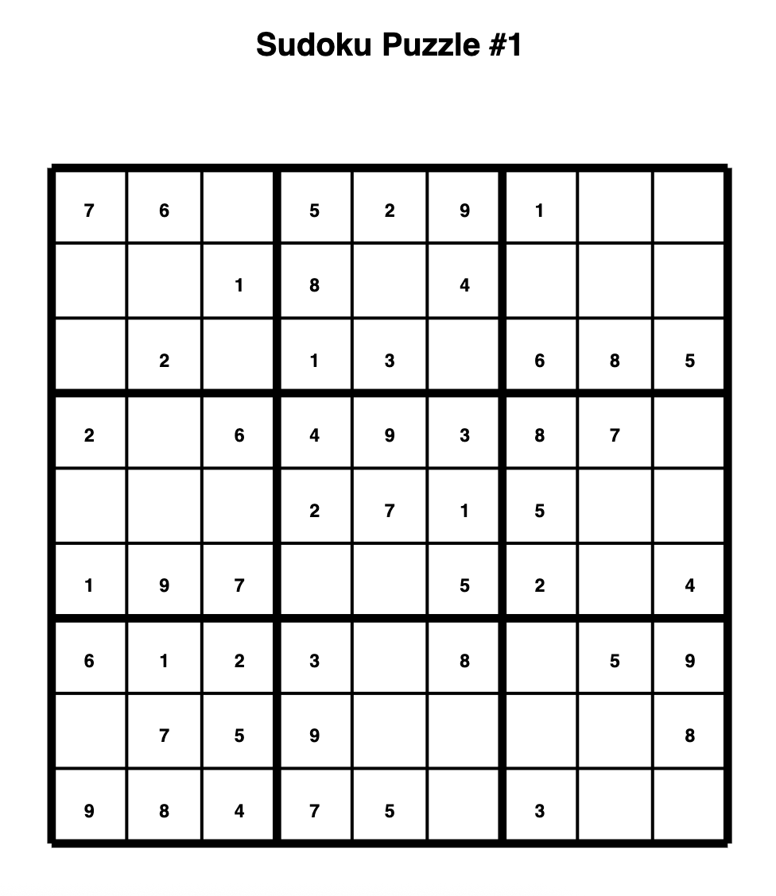
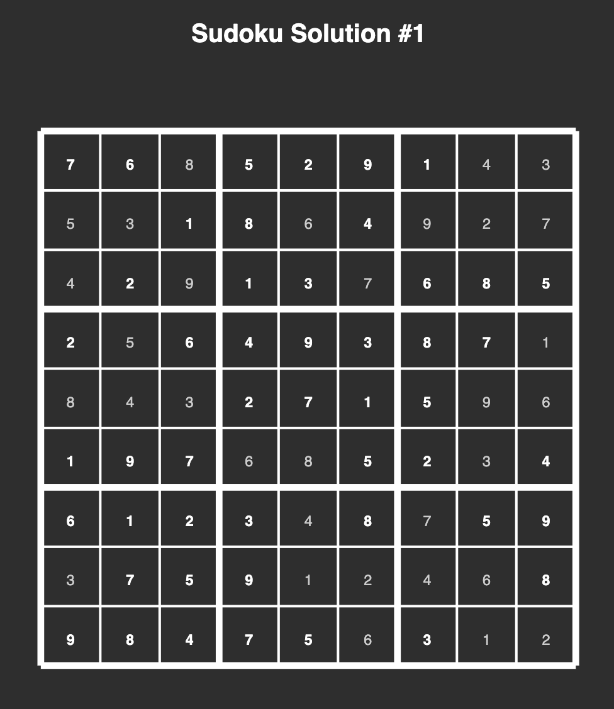

# Sudoku Generator

A simple and flexible Sudoku generator that can create puzzles of different sizes and difficulty levels, with PDF export functionality.

## Installation

```bash
npm install @amanwebdev/sudoku-generator
```

## Usage

### Basic Sudoku Generation

```javascript
const { generateSudoku } = require('@amanwebdev/sudoku-generator');

// Generate a 9x9 Sudoku with easy difficulty
const sudoku = generateSudoku(9, 'easy');

console.log('Puzzle:');
console.log(sudoku.grid);

console.log('Solution:');
console.log(sudoku.solution);
```

### PDF Export

```javascript
const { generateSudoku, toPDF } = require('@amanwebdev/sudoku-generator');
const fs = require('fs');

const sudoku = generateSudoku(9, 'easy');

// Generate puzzle PDF
const puzzlePdf = await toPDF(sudoku.grid, {
  title: 'Sudoku Puzzle #1',
  theme: 'light'
});
fs.writeFileSync('puzzle.pdf', puzzlePdf);

// Generate solution PDF with visual distinction
const solutionPdf = await toPDF(sudoku.grid, {
  title: 'Sudoku Solution #1',
  theme: 'light',
  showSolution: true
}, sudoku.solution);
fs.writeFileSync('solution.pdf', solutionPdf);
```

### Image Export

```javascript
const { generateSudoku, toImage } = require('@amanwebdev/sudoku-generator');
const fs = require('fs');

const sudoku = generateSudoku(9, 'medium');

// Generate puzzle image
const puzzleImage = toImage(sudoku.grid, {
  theme: 'light',
  cellSize: 80,
  format: 'png'
});
fs.writeFileSync('puzzle.png', puzzleImage);

// Generate solution image with visual distinction
const solutionImage = toImage(sudoku.grid, {
  theme: 'dark',
  cellSize: 60,
  format: 'jpeg',
  quality: 0.9,
  showSolution: true
}, sudoku.solution);
fs.writeFileSync('solution.jpg', solutionImage);
```

## API

### `generateSudoku(size, difficulty)`

Generates a new Sudoku puzzle.

**Parameters:**
-   `size`: The size of the Sudoku grid. Can be `4`, `6`, or `9`.
-   `difficulty`: The difficulty of the puzzle. Can be `'easy'`, `'medium'`, or `'hard'`.

**Returns:** A `Sudoku` object with the following properties:
-   `size`: The size of the Sudoku grid.
-   `grid`: A 2D array representing the puzzle (0 = empty cell).
-   `solution`: A 2D array representing the complete solution.
-   `difficulty`: The difficulty level used.

### `toPDF(grid, options?, solution?)`

Exports a Sudoku grid to PDF format.

**Parameters:**
-   `grid`: A 2D number array representing the puzzle grid
-   `options`: Optional PDF configuration object
-   `solution`: Optional 2D number array for solution display (required when `showSolution: true`)

**Options:**
-   `theme`: `'light'` | `'dark'` | custom theme object (default: `'light'`)
-   `title`: PDF title text (default: `'Sudoku Puzzle'`)
-   `author`: PDF author metadata (default: `'Sudoku Generator'`)
-   `subject`: PDF subject metadata (default: `'Sudoku Puzzle'`)
-   `keywords`: PDF keywords metadata (default: `'sudoku, puzzle, game'`)
-   `showSolution`: Boolean to display solution with visual distinction (default: `false`)

**Custom Theme:**
```javascript
{
  background: '#ffffff',
  gridColor: '#000000', 
  textColor: '#000000',
  boxLineColor: '#000000'
}
```

**Returns:** `Promise<Uint8Array>` - PDF file as bytes

### `toImage(grid, options?, solution?)`

Exports a Sudoku grid to image format (PNG or JPEG).

**Parameters:**
-   `grid`: A 2D number array representing the puzzle grid
-   `options`: Optional image configuration object
-   `solution`: Optional 2D number array for solution display (required when `showSolution: true`)

**Options:**
-   `theme`: `'light'` | `'dark'` | custom theme object (default: `'light'`)
-   `cellSize`: Size of each cell in pixels (default: `60`)
-   `showSolution`: Boolean to display solution with visual distinction (default: `false`)
-   `format`: `'png'` | `'jpeg'` - Output image format (default: `'png'`)
-   `quality`: JPEG quality from 0 to 1 (default: `0.95`, only applies to JPEG format)

**Returns:** `Buffer` - Image file as bytes

## Sample Output

### Puzzle PDF
Clean, printable Sudoku puzzles with professional formatting:



### Solution PDF  
Solutions with visual distinction between given and solved digits:



## Features

### PDF Export
- **A4 Portrait Layout**: Professional 210×297mm format
- **Multiple Grid Sizes**: Optimized layouts for 4×4, 6×6, and 9×9 grids
- **Theme Support**: Light, dark, and custom color themes
- **Solution Display**: Visual distinction between given and solved digits
- **Metadata Support**: Title, author, subject, and keywords
- **Print Ready**: Proper stroke weights and sizing for printing

### Image Export
- **Flexible Canvas Size**: Configurable cell sizes for different output resolutions
- **Multiple Formats**: PNG and JPEG export with quality control
- **Theme Support**: Same theming system as PDF export
- **Solution Overlay**: Visual distinction between given and solved digits
- **Server-side Rendering**: Node.js canvas-based generation
- **Scalable Output**: Adjustable dimensions for web, print, or display use

### Visual Design
- **Given digits**: Bold, full opacity
- **Solution digits**: Normal weight, lighter color for clear distinction
- **Responsive sizing**: Cell sizes adjust based on grid size
- **Clean typography**: Centered numbers with proper spacing
